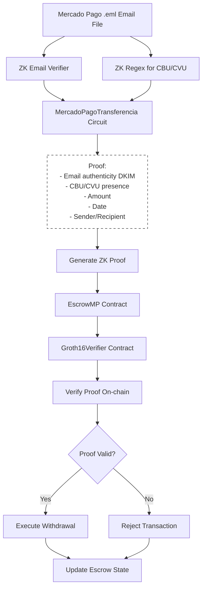

# 10GO

  

## Project Overview

10GO is a decentralized platform designed to onboard users from traditional payment systems like Mercado Pago into the world of crypto. By leveraging zero-knowledge proofs for decentralized settlement and account abstraction, 10GO simplifies the transition to crypto for new users, while laying the foundation for future features like collateralized lending and microcredits.

With 10GO, you've got it! ✊

## Repository Structure

- **[Front-end Code](https://github.com/10GO-labs/10GO-frontend)**: Source code for the front-end application.
- **[Smart Contract Code](https://github.com/10GO-labs/10GO-contracts)**: Smart contract for the escrow, enabling decentralized settlements, deployed [here](https://sepolia.etherscan.io/address/0xbc9cA80364f4bbF56211768519db012F0A76aee2#code).
- **[ZK Circuits Code](https://github.com/yagopajarino/zk-email-minimal)**: Zero-knowledge circuits for transaction validation. Implementation of the zk email library to demonstrate a proof of knowledge from a cryptographically signed email.

## How It Works

The following steps, illustrated in the accompanying flowchart, summarize how 10GO processes a Mercado Pago transaction email into a verifiable withdrawal:

1. **Email Processing**: The system starts by processing a Mercado Pago .eml email file containing transaction details.

2. **ZK Circuits**: Two zero-knowledge circuits work in parallel:
   - The ZK Email Verifier checks the DKIM signature to ensure email authenticity.
   - The ZK Regex extracts the CBU/CVU number from the email body.

3. **Proof Generation**: The MercadoPagoTransferencia circuit combines the results to generate a zero-knowledge proof. This proof confirms the email's authenticity, the presence of the specific CBU/CVU, transaction amount, date, and relevant party information, all without revealing the raw email contents.

4. **Smart Contract Interaction**: The user initiates a withdrawal by interacting with the EscrowMP smart contract, providing the generated ZK proof.

5. **On-chain Verification**: The EscrowMP contract calls the Groth16Verifier contract, which performs cryptographic verification of the proof using embedded verification keys and pairing operations.

6. **Withdrawal Execution**: If the proof is valid, the EscrowMP contract executes the withdrawal, transferring the specified amount to the user. If invalid, the transaction is rejected.

7. **Escrow State Update**: The EscrowMP contract updates the escrow state to reflect the withdrawal or maintain the current state if the transaction was rejected.

## About

**10GO** is an open-source project developed by [Nicolás Biondini](https://github.com/NicolasBiondini), [Yago Pajariño](https://github.com/yagopajarino), [Alejandro Almaraz](https://github.com/almaraz97) and [Arturo Beccar-Varela](https://github.com/arturoBeccar). With expertise in blockchain, cryptography, front-end development and financial risk management, we aim to bring trust and privacy to financial transactions. 

We joined this hackathon as students of the [PSE Core Program](https://pse.dev/en/programs), eager to make a real-world impact with programmable cryptography.

## License

This project is licensed under the AGPLv3 License. See the [LICENSE](LICENSE) file for details.
